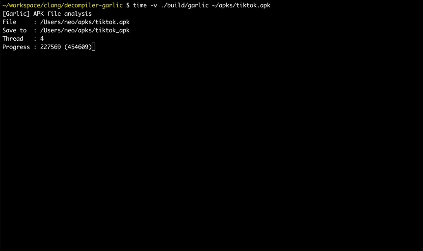

# Garlic decompiler
[](http://www.apache.org/licenses/LICENSE-2.0.html)

[](https://t.me/+8N--zZal0KExMzA1)


English | [Chinese](README.CN.md)

The world's fastest apk (android)/java open source decompiler

Android/Java decompiler written in C

Tool for produces java source code from class/jar/dex/apk file

### Features

* decompile apk file
* decompile dex file
* decompile class file
* decompile jar file
* decompile war file

### Install

* macos/linux
``` shell
brew install neocanable/decompiler/garlic
```


### Build

##### 1. Build on linux/macOS 

​	**requirements**: cmake >= **3.26**


```sh
git clone https://github.com/neocanable/garlic.git
cd garlic
cmake -B build
cmake --build build
./build/garlic
```


##### 2. Build on Windows

please check the [windows build document](docs/build-garlic-on-windows.md)

Also see [Garlic on Windows](docs/garlic-on-windows.md) for performance tips and known issues.

##### 3. Build with Zig (cross-platform)

​	**requirements**: zig >= **0.16.0**

Build for your host platform directly:

```sh
git clone https://github.com/neocanable/garlic.git
cd garlic
zig build --release=fast
./zig-out/bin/garlic
```

Cross-compile to any target with `-Dtarget`:

```sh
# Linux x86_64 (musl)
zig build --release=fast -Dtarget=x86_64-linux-musl

# Linux x86_64 (glibc)
zig build --release=fast -Dtarget=x86_64-linux-gnu

# Linux aarch64
zig build --release=fast -Dtarget=aarch64-linux-musl

# Linux i686 (32-bit)
zig build --release=fast -Dtarget=x86-linux-musl

# Windows x86_64
zig build --release=fast -Dtarget=x86_64-windows

# Windows 32-bit
zig build --release=fast -Dtarget=x86-windows

# macOS x86_64 (Intel)
zig build --release=fast -Dtarget=x86_64-macos

# macOS aarch64 (Apple Silicon)
zig build --release=fast -Dtarget=aarch64-macos
```

Zig bundles its own cross-linkers and libc, so **no cross-toolchain needs to be installed** — everything works out of the box. The output goes to `zig-out/bin/`.


### Usage

* decompile apk
  ```sh
  garlic /path/to/android.apk
  
  garlic /path/to/android.apk -o /path/to/save # -o option is source code output path
  
  garlic /path/to/android.apk -t 5             # -t option is thread count, default is 4
  ```

* decompile .dex file
  ```sh
  garlic /path/to/classes.dex
  
  garlic /path/to/classes.dex -o /path/to/save # -o option is source code output path
  
  garlic /path/to/classes.dex -t 5             # -t option is thread count, default is 4
  ```

* decompile .class file

    decompile .class file, default output is **stdout**
    ```sh
    garlic /path/to/jvm.class
    ```


* decompile jar file
    ```sh
    garlic /path/to/file.jar
    
    garlic /path/to/file.jar -o /path/to/save # -o option is source code output path
    
    garlic /path/to/file.jar -t 5             # -t option is thread count, default is 4
    ```

    default output is same level directory as the file


* javap 
  
    like javap, more faster, disabled LineNumber and StackMapTable attributes
    ```sh
    garlic /path/to/jvm.class -p
    ```

* dexdump
    ```sh
    garlic /path/to/dalvik.dex -p           
    
    ```

* search string
  ```
  garlic ~/demo/demo.apk -f "windowInfo" # search "windowInfo" in demo.apk
  ```

  ```
  garlic ~/demo/demo.jar -f "[W|w]indow" # search regex [W|w]indow in demo.jar
  ```

  ```
  garlic ~/demo/demo.dex -f "info" # search contains string "info" in demo.dex
  ```


### Debug

in **src/jvm.c**, change main function to: 

```c
int main(int argc, char **argv)
{
    jar_file_analyse(path_of_jar, out_of_jar, 1);
    return 0;
}

```

if thread count less than 2, it will disable multiple thread.


### Speed

decompile newest(2025-06-16) wechat.apk which size is 200M+ and 19w+ classes need 12 seconds

```sh
garlic ~/wechat/wechat.apk
[Garlic] APK file analysis
File     : ~/wechat/wechat.apk
Save to  : ~/wechat/wechat_apk
Thread   : 4
Progress : 192538 (192538)
[Done]
```




### Garlic + Rosemary pipeline

[Video](https://youtu.be/I_cwuW4UKOs?si=eTCFuC1XzHuBi5a0)


### Customization

**Email:**   neocanable#gmail.com (replace # to @)

**wechat:** neocanable


--------------------------------------------
*Licensed under the Apache 2.0 License*
